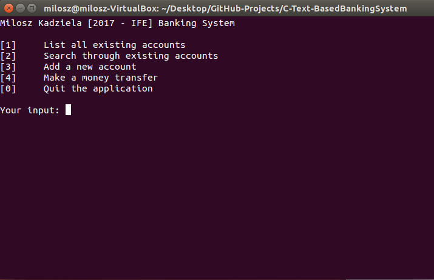

# Text-based banking system created in C by Milosz Kadziela

## Description:
This is a banking system with a list of account saved in text file. You can navigate through the system using the terminal. Basic functionalities include:
- Adding new account
- Transferring money
- Making a payment
- Viewing all accounts with current balance

## Screenshot of the application:

## Prerequisites:
- gcc (or any other C compiler)

## How to set up:
1. Open terminal
2. Run `make` (all compilation options are described in the makefile)
3. Execute file `banking-system`